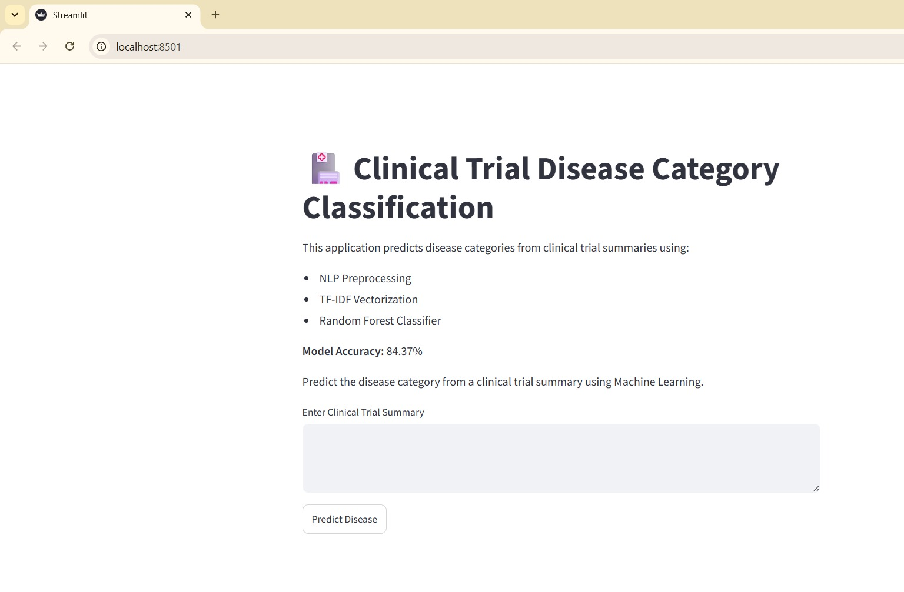
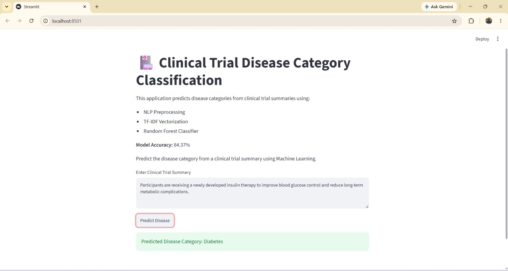
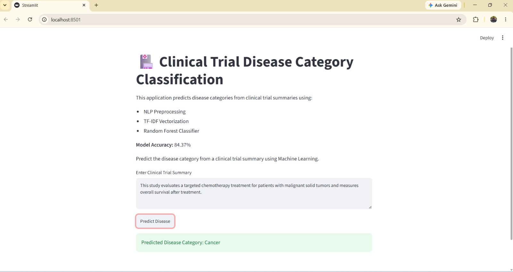
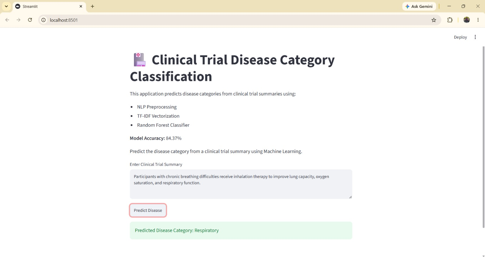

# 🏥 Clinical Trial Disease Category Classification

An NLP + Machine Learning pipeline that classifies clinical trial summaries into disease categories, wrapped in an interactive Streamlit app for real-time prediction.

## 📌 Project Overview

Clinical trial datasets contain large volumes of unstructured text describing study conditions and summaries. Manually categorizing these by disease is slow and inconsistent. This project automates that classification — cleaning and preprocessing clinical trial summaries, engineering TF-IDF features, and training a model to predict the disease category directly from free text.

## 🚀 Key Features

**Data & NLP Pipeline**
- Cleaned and mapped 60,337 raw clinical trial records down to 10,971 labeled records
- Text preprocessing: lowercasing, special character removal, stopword removal, lemmatization
- Disease category derived from the `conditions` column via keyword mapping (Cancer, Diabetes, COVID, Respiratory, Arthritis, Mental Health, Blood Disorder, Other)

**Feature Engineering**
- TF-IDF vectorization of clinical trial `brief_summary` text

**Machine Learning**
- Compared Logistic Regression (84.19%), Naive Bayes (77.81%), and Random Forest (84.37%)
- Random Forest selected as the final model
- Evaluated with Accuracy, Precision, Recall, F1-Score, and Confusion Matrix

**Interactive App**
- Streamlit app for entering a clinical trial summary and getting an instant predicted disease category

## 📸 Screenshots

**App Overview**



**Sample Predictions**





## 🛠 Tech Stack

Python · Pandas · NumPy · NLTK · Scikit-learn · Matplotlib · Seaborn · Streamlit · Pickle

## 📁 Project Structure

```
Clinical-Trial-Disease-Classification/
├── Data/
│   └── clinical_trials_raw_patient2trial_conditions.csv   (not included, see note)
├── docs/
│   ├── Clinical_Trial_Disease_Presentation.pptx
│   └── Clinical_Trial_Disease_Report.pdf
├── screenshots/
│   ├── app_home.jpeg
│   ├── prediction_diabetes.jpeg
│   ├── prediction_cancer.jpeg
│   └── prediction_respiratory.jpeg
├── app.py
├── project5_clinical_trial.ipynb
├── requirements.txt
├── .gitignore
├── LICENSE
└── README.md
```

⚠️ **Note on data files:** the raw dataset (`clinical_trials_raw_patient2trial_conditions.csv`, ~152MB) exceeds GitHub's 100MB file size limit and is not included in this repository. Source: [ClinicalTrials.gov](https://clinicaltrials.gov/). To reproduce the pipeline, place the raw CSV in a `Data/` folder at the project root and run `project5_clinical_trial.ipynb` top to bottom — it will regenerate `disease_model.pkl`, `tfidf.pkl`, and `label_encoder.pkl`, which `app.py` expects to find at the project root.

## ⚙️ How to Run

1. Clone the repository
   ```
   git clone https://github.com/meetthaheerhere-ds/Clinical-Trial-Disease-Classification.git
   cd Clinical-Trial-Disease-Classification
   ```

2. Install dependencies
   ```
   pip install -r requirements.txt
   ```

3. Generate the model files (required — not shipped in the repo, see note above)

   Run `project5_clinical_trial.ipynb` top to bottom in Jupyter. This trains the model and saves `disease_model.pkl`, `tfidf.pkl`, and `label_encoder.pkl` to the project root.

4. Launch the app
   ```
   streamlit run app.py
   ```

## 📈 Key Insights

- Random Forest slightly outperformed Logistic Regression despite the smaller margin, and clearly outperformed Naive Bayes
- Disease categories were derived from free-text `conditions` via keyword mapping rather than pre-labeled data, showing the pipeline can work on loosely structured medical text
- TF-IDF + classical ML was sufficient to reach ~84% accuracy across 8 disease categories

## 🎯 Project Outcome

- Built a complete NLP-to-deployment pipeline for medical text classification
- Compared and evaluated 3 classification algorithms for disease category prediction
- Developed an interactive Streamlit app for real-time clinical trial summary classification

## 📌 Future Enhancements

- Deploy on Streamlit Community Cloud
- Experiment with more granular disease category labels beyond the current 8 groups
- Try transformer-based embeddings (e.g. BioBERT) in place of TF-IDF for improved accuracy

## 👨‍💻 Author

Thaheer A
